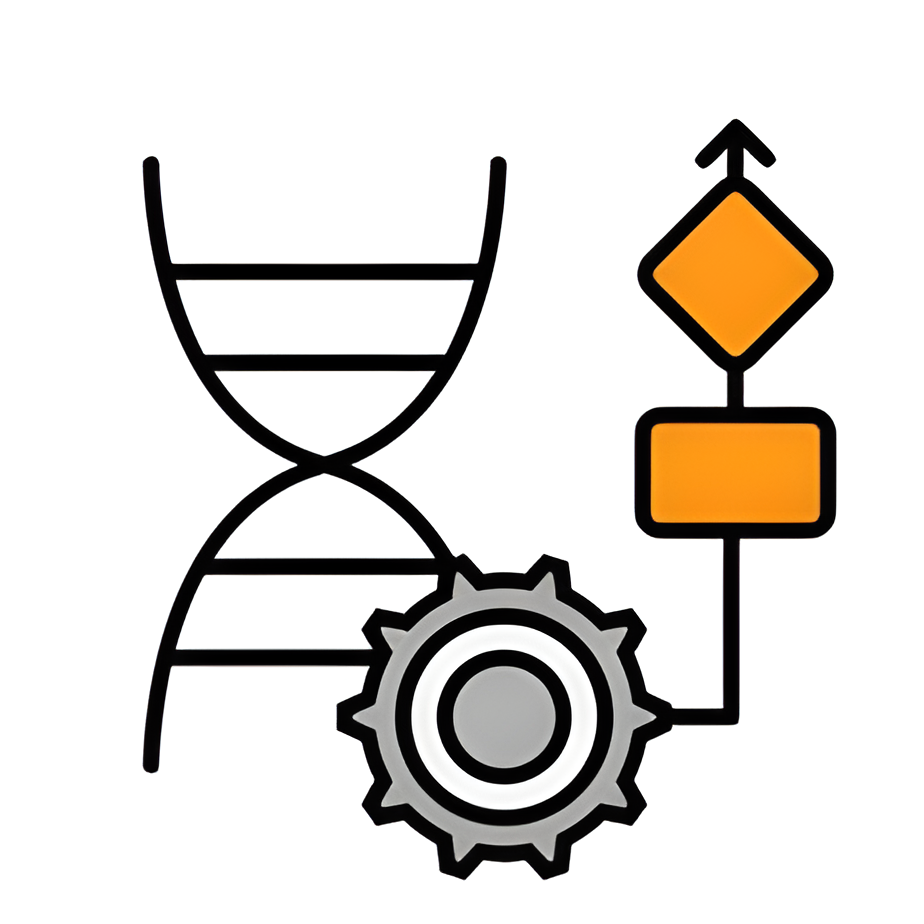

<!-- PROJECT LOGO -->
<br />
<div align="center">
  <a href="https://github.com/nicolassalomon96/Genetic_Car">
    
  </a>

<h3 align="center">Genetic Algorithm applied to an Autonomous Driving System </h3>

  <p align="center">
    Genetic Algorithm to train an autonomous vehicle, enabling it to learn and optimize its driving on a simulated track efficiently.
    <br />
    <a href="https://github.com/nicolassalomon96/Genetic_Car"><strong>Explore the docs »</strong></a>
    <br />
    <br />
    <a href="https://drive.google.com/file/d/1Ueg6gy79dNppmXqY81GYJQj8bqjrv-Y7/view?usp=sharing">View Demo</a>
    ·
    <a href="https://github.com/nicolassalomon96/Genetic_Car/issues/new?labels=bug&template=bug-report---.md">Report Bug</a>
    ·
    <a href="https://github.com/nicolassalomon96/Genetic_Car/issues/new?labels=enhancement&template=feature-request---.md">Request Feature</a>
  </p>
</div>


<!-- TABLE OF CONTENTS -->
<details>
  <summary>Table of Contents</summary>
  <ol>
    <li>
      <a href="#about-the-project">About The Project</a>
      <ul>
        <li><a href="#built-with">Built With</a></li>
      </ul>
    </li>
    <li>
      <a href="#getting-started">Getting Started</a>
      <ul>
        <li><a href="#prerequisites">Prerequisites</a></li>
        <li><a href="#installation">Installation</a></li>
      </ul>
    </li>
    <li><a href="#usage">Usage</a></li>
    <li><a href="#contact">Contact</a></li>
  </ol>
</details>


<!-- ABOUT THE PROJECT -->
## About The Project

![Product Name Screen Shot][product-screenshot]

* Project Summary and Importance

This project applies the NEAT (NeuroEvolution of Augmenting Topologies) algorithm to evolve a fully connected multilayer neural network that controls the movement of a car on a track. The network learns to manage both acceleration and steering, optimizing the car’s performance as it navigates the course.

* Applications

The significance of this project lies in its ability to showcase how evolutionary algorithms, like NEAT, can be applied to complex control tasks in autonomous systems. By evolving neural network structures rather than simply optimizing pre-defined models, the NEAT algorithm can discover novel network architectures that may outperform traditional approaches in autonomous driving systems. This has potential applications in fields such as self-driving cars, robotics, and any system requiring adaptive, intelligent control.

* Advantages

1. **Dynamic Architecture Evolution:** Unlike traditional neural networks, NEAT evolves both the weights and the topology of the network. This allows for more flexible solutions that adapt to the complexity of the task over time.
2. **Exploration of Novel Solutions:** NEAT fosters innovation in network architectures, potentially finding solutions that traditional methods might not consider. This is crucial in dynamic environments like autonomous driving, where conventional architectures might fail to generalize.
3. **No Need for Pre-Designed Architectures:** NEAT removes the need for extensive manual tuning of neural network architectures, which can be time-consuming and suboptimal. Instead, it automatically discovers the most efficient design for the task at hand.
4. **Applicability to Various Environments:** The NEAT algorithm's adaptive nature makes it useful for a wide range of autonomous systems beyond driving, such as robotic control or drones, where both the control and decision-making processes are critical.

* Conclusions

This implementation highlights the power of combining genetic algorithms with neural networks to solve real-world problems. By autonomously learning how to control the car’s speed and steering, the system not only demonstrates the effectiveness of the NEAT algorithm in optimizing neural network architectures but also offers insights into how such approaches can be applied to more complex environments and scenarios in the future of autonomous driving.

<p align="right">(<a href="#readme-top">back to top</a>)</p>


### Built With

* [![Python][Python]][Python-url]
* [![NumPy][NumPy]][NumPy-url]
* [![Pygame][Pygame]][Python-url]


<p align="right">(<a href="#readme-top">back to top</a>)</p>


<!-- GETTING STARTED -->
## Getting Started

This is an example of how you may set up this project locally in your computer.
To get a local copy up and running follow these simple example steps.

### Prerequisites

Install the packages listed on requirements.txt:
  ```sh
  pip install -r requirements.txt
  ```
### Installation

1. Clone the repo
   ```sh
   git clone https://github.com/nicolassalomon96/Genetic_Car
   ```
2. Install required packages listed on Prerequisites

<p align="right">(<a href="#readme-top">back to top</a>)</p>


<!-- USAGE EXAMPLES -->
## Usage

In order to probe or use this project you must run main.py script:
```sh
  python main_ai.py
```

This scripts will train the NEAT algorithm automatically and save the best checkpoints. If you want to drive the car manually (using your keyboard), please run:
```sh
  python main_manual.py
```


<p align="right">(<a href="#readme-top">back to top</a>)</p>

<!-- DEMO VIDEO -->
## Usage

If you want to see a demo video, please go to: <a href="https://drive.google.com/file/d/1Ueg6gy79dNppmXqY81GYJQj8bqjrv-Y7/view?usp=sharing">View Demo</a>


<!-- ROADMAP -->
<!--
## Roadmap

- [ ] Feature 1
- [ ] Feature 2
- [ ] Feature 3
    - [ ] Nested Feature

See the [open issues](https://github.com/github_username/repo_name/issues) for a full list of proposed features (and known issues).

<p align="right">(<a href="#readme-top">back to top</a>)</p>
-->

<!-- CONTRIBUTING -->
<!--
## Contributing

Contributions are what make the open source community such an amazing place to learn, inspire, and create. Any contributions you make are **greatly appreciated**.

If you have a suggestion that would make this better, please fork the repo and create a pull request. You can also simply open an issue with the tag "enhancement".
Don't forget to give the project a star! Thanks again!

1. Fork the Project
2. Create your Feature Branch (`git checkout -b feature/AmazingFeature`)
3. Commit your Changes (`git commit -m 'Add some AmazingFeature'`)
4. Push to the Branch (`git push origin feature/AmazingFeature`)
5. Open a Pull Request

<p align="right">(<a href="#readme-top">back to top</a>)</p>
-->


<!-- LICENSE -->
<!--
## License

Distributed under the MIT License. See `LICENSE.txt` for more information.

<p align="right">(<a href="#readme-top">back to top</a>)</p>
-->


<!-- CONTACT -->
## Contact
Any comment or contribution is welcome and I will be attentive to respond to you :)

Nicolás Salomón - [Linkedin](https://www.linkedin.com/in/nicolassalomon96/) - [Gmail](nicolassalomon96@gmail.com)

Project Link: [https://github.com/nicolassalomon96/Genetic_Car](https://github.com/nicolassalomon96/Genetic_Car)

<p align="right">(<a href="#readme-top">back to top</a>)</p>


<!-- MARKDOWN LINKS & IMAGES -->
<!-- https://www.markdownguide.org/basic-syntax/#reference-style-links -->
[product-screenshot]: images/system.png
[Python]: https://img.shields.io/badge/python-3670A0?style=for-the-badge&logo=python&logoColor=ffdd54
[Python-url]: https://www.python.org/
[NumPy]: https://img.shields.io/badge/-NumPy-013243?style=flat&logo=numpy&logoColor=white
[NumPy-url]: https://numpy.org/
[Pygame]: images/pygame_logo.png
[Pygame-url]: https://www.pygame.org/news